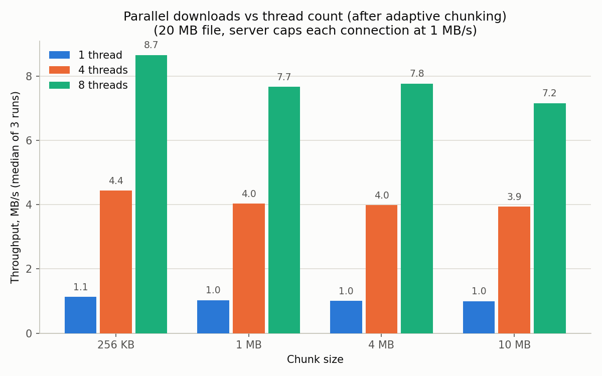
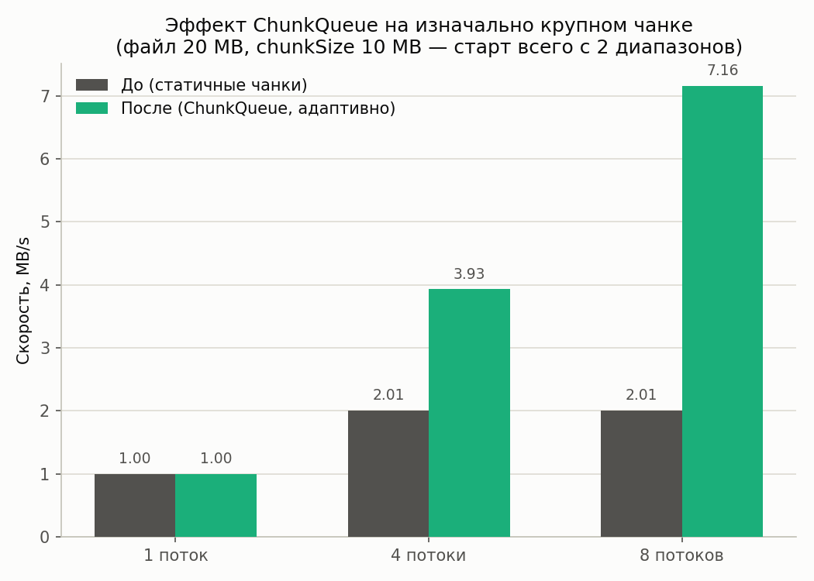

# Multithreaded Download Manager (dlm)

[](https://github.com/MAX959954/download_manager/actions/workflows/ci.yml)

A multithreaded download manager in C++: parallel file downloads over
HTTP Range requests, a thread pool, resume after interruption, speed
limiting, and a Qt UI.

## About the project

Multithreaded Download Manager is a desktop download manager built with
C++17/Qt that downloads a file over several parallel connections, splitting
it into chunks and requesting each one via `Range: bytes=`.

### Key features

- **Parallel downloads** — a custom thread pool (`std::thread` +
  `condition_variable`); N workers independently download chunks
  `[offset, offset+size)` of a single file.
- **Pause and resume** — state is saved to a metafile next to the download
  (a bitmap of completed chunks, ETag/Last-Modified), so the download
  continues after an app restart or a network interruption.
- **Direct offset writes** — each worker writes to its own region of the
  file (seek/pwrite), with no temporary parts or final merge step.
- **Speed control** — bandwidth limiting via a token bucket, with both a
  global limit and a per-download limit.
- **Integrity checking** — checksum verification (SHA-256) after
  completion.
- **Cancellation** — cooperative stop via `std::atomic` / a stop token at
  any stage.
- **Qt GUI** — a job queue, per-chunk progress, current speed,
  pause/resume/cancel.
- The HTTP layer is abstracted behind the `IHttpClient` interface: a
  libcurl implementation and (eventually) an alternative client built on
  raw sockets + OpenSSL.

## Building

Requires [vcpkg](https://github.com/microsoft/vcpkg) (the `VCPKG_ROOT`
environment variable), CMake ≥ 3.21 and Ninja.

```bash
cmake --preset default
cmake --build build/default
```

The built CLI:

```bash
./build/default/download_manager <url> -o <file>
```

By default that's a single connection with no chunking (Stage 1). To
actually use the parallel engine described below:

```bash
# Multiple connections, adaptive chunking
./build/default/download_manager <url> -o <file> --parallel --workers 8

# Same, but resumable across runs (progress saved to <file>.dlm)
./build/default/download_manager <url> -o <file> --resume --workers 8

# Cap bandwidth and verify a checksum
./build/default/download_manager <url> -o <file> --parallel --rate-limit 2M --sha256 <hex>
```

Run `download_manager --help` for the full flag list (`--chunk-size`,
`--retries`, …). Ctrl+C during a `--resume` download cancels cleanly and
leaves the `.dlm` metafile in place, so rerunning the same command picks
up where it left off.

### Building the Qt GUI

The GUI (`gui/`, target `dlm_gui`) is optional and off by default, since
Qt is a heavy first-time vcpkg build. It's a thin Qt Widgets layer on top
of the same `dlm_core` engine the CLI uses: add a URL, watch a live
progress bar per job (polled from `DownloadManager` every 500 ms), and
pause/resume/cancel each download.

First, install the Qt dependency via vcpkg (one-time, takes a while to
build from source the first time):

```bash
vcpkg install qtbase[widgets] --triplet x64-mingw-dynamic
```

Then configure and build with the `gui` preset, which turns on both the
vcpkg `gui` manifest feature and the `DLM_BUILD_GUI` CMake option:

```bash
cmake --preset gui
cmake --build build/gui
```

The built GUI executable:

```bash
./build/gui/gui/download_manager_gui
```

If Qt6 isn't found, `gui/CMakeLists.txt` just skips the `dlm_gui` target
with a `STATUS` message instead of failing the build — so building without
the `gui` preset/feature is unaffected.

## CI and thread-safety checks

GitHub Actions on every push/PR:

- **build & test** — a regular Debug build (Linux, system `libcurl`/`openssl`),
  running all offline tests via `ctest`.
- **sanitizers** — the same tests, built and run under
  **ThreadSanitizer** and **AddressSanitizer + UndefinedBehaviorSanitizer**.
  `Downloader`/`DownloadManager` drive `curl`/sockets across several
  `std::thread`s, sharing `FileWriter`, the metafile, and atomic pause
  flags — TSan genuinely catches races here if they show up, rather than
  just being a "green checkmark for show."
- **live network tests** — a separate, optional job: three tests make real
  network calls (a TLS handshake and Range requests to
  raw.githubusercontent.com) and verify `SocketHttpClient`/`CurlHttpClient`
  against a live server with SHA-256 verification. These are split out and
  marked `continue-on-error` so that transient network issues on the
  runner don't color the main build.

Locally, the same thing:

```bash
cmake -S . -B build-tsan -G Ninja -DCMAKE_BUILD_TYPE=Debug \
  -DCMAKE_CXX_FLAGS="-fsanitize=thread -fno-omit-frame-pointer -g" \
  -DCMAKE_EXE_LINKER_FLAGS="-fsanitize=thread -fno-omit-frame-pointer -g"
cmake --build build-tsan
ctest --test-dir build-tsan --output-on-failure -LE live
```

## Benchmark: parallelism really does speed up downloads



**Methodology.** We download the same file (20 MB) via
`Downloader::downloadParallel` on top of our own `SocketHttpClient`
(Stage 8) from a local HTTP server (`benchmarks/throttled_server.py`),
which artificially throttles the speed of **each individual TCP
connection** to 1 MB/s — this models the typical scenario parallel
downloads exist for in the first place: many real servers/CDNs limit
speed per connection rather than in aggregate. The local server gives
reproducible numbers (no internet noise), but the effect itself — the
speedup from multiple connections — is entirely real. Each data point is
the median of 3 runs.

| Chunk   | 1 thread | 4 threads | 8 threads | 8 vs 1 speedup |
|---------|----------|-----------|-----------|-----------------|
| 256 KB  | 1.1 MB/s | 4.4 MB/s  | 8.7 MB/s  | **~7.9x**       |
| 1 MB    | 1.0 MB/s | 4.0 MB/s  | 7.7 MB/s  | **~7.5x**       |
| 4 MB    | 1.0 MB/s | 4.0 MB/s  | 7.8 MB/s  | **~7.8x**       |
| 10 MB   | 1.0 MB/s | 3.9 MB/s  | 7.2 MB/s  | **~7.2x**       |

The speedup is now almost independent of chunk size — and that wasn't
always the case.

### Adaptive chunking / work stealing

Originally (handing out fixed chunks statically, one HTTP request per
chunk), the result depended heavily on chunk size: with a 4 MB chunk on a
20 MB file you get only 5 chunks, and the 8th thread simply has nothing to
download — the gain was capped at 5 simultaneous connections, not the
number of threads. With a 10 MB chunk (2 chunks per file) the effect is
even worse: **4 and 8 threads gave the same 2.01 MB/s** — the extra
threads did nothing at all.

To fix this, `Downloader::downloadParallel` no longer hands out a fixed
list of ranges to workers up front. Instead
([`ChunkQueue`](core/include/dlm/ChunkQueue.hpp)), every worker that frees
up goes to a shared queue for the next range — and if there are fewer
ranges in the queue than workers, the largest of the remaining ranges is
split in half right at hand-out time. In effect, this is a free worker
"stealing" the not-yet-started half of someone else's range — honest
work-stealing to the extent it's even possible on top of HTTP: an
in-flight Range request can't be interrupted (a TCP stream can't be cut
short without closing and reopening the connection), so only what hasn't
been handed out to anyone yet gets split.



| Threads | Before (static chunks) | After (ChunkQueue) |
|---------|-------------------------|----------------------|
| 1       | 1.00 MB/s               | 1.00 MB/s            |
| 4       | 2.01 MB/s               | 3.93 MB/s            |
| 8       | 2.01 MB/s               | **7.16 MB/s**        |

With a 10 MB chunk, the old code didn't speed up at all past 4 threads
(capped by the 2 original chunks); the new one scales almost linearly and
reaches the same level as small chunks even at 8 threads. "Before" was
measured the same way on the same server — a reconstruction of the
original static algorithm lives in `benchmarks/old_static_bench.cpp` (not
part of the production code, used only for this comparison).

Run it yourself:

```bash
python3 benchmarks/throttled_server.py 8787 &
cmake -S . -B build-bench -G Ninja -DCMAKE_BUILD_TYPE=Release -DDLM_BUILD_BENCHMARKS=ON
cmake --build build-bench
./build-bench/benchmarks/bench_downloader http://127.0.0.1:8787/file benchmarks/results.csv 3
python3 benchmarks/plot_results.py
python3 benchmarks/plot_before_after.py
```

## Roadmap

- [x] **Stage 0. Skeleton** — CMake project (`core` / `cli` / `gui` later),
      dependencies via vcpkg, `dlm_core` linked against libcurl.
- [x] **Stage 1. One connection, one file** — `IHttpClient` / `CurlHttpClient`
      on top of a libcurl easy handle (redirects, `Content-Length`,
      `Accept-Ranges`, `ETag`/`Last-Modified`), `Downloader::downloadToFile`
      streams the response body to a file. `dlm <url> -o file` works.
- [x] **Stage 2. Chunks, but sequential** — splitting into fixed-size
      chunks, file preallocation, offset writes (`Downloader::downloadChunked`).
- [x] **Stage 3. Thread pool** — a custom worker pool
      (`ThreadPool`/`ChunkQueue`), chunks downloaded in parallel with
      adaptive splitting (`Downloader::downloadParallel`).
- [x] **Stage 4. Resume** — a `file.dlm` metafile, `If-Range`, a bitmap of
      completed chunks (`Downloader::downloadResumable`).
- [x] **Stage 5. Pause/cancel** — cooperative stop via `CancelToken`,
      polled from every worker and wired up to Ctrl+C in the CLI.
- [x] **Stage 6. Download manager** — `DownloadManager` runs a queue of
      jobs with a cap on concurrent downloads, each with pause/resume/cancel.
- [x] **Stage 7. Qt GUI** — a thin Qt Widgets layer on top of the engine's
      API (`gui/`, target `dlm_gui`, off by default — see "Building the Qt
      GUI" above): add/list downloads, a live per-job progress bar, and
      pause/resume/cancel, polling `DownloadManager::allJobs()` on a timer.
- [x] **Stage 8. The "wow" stage** — a token bucket (`RateLimiter`),
      SHA-256 verification, retries with backoff, and a custom HTTP+TLS
      client on raw sockets (`SocketHttpClient`).

Everything except the Qt GUI is also reachable from the CLI — see
`download_manager --help`.

### Decisions made up front

| Question | Decision |
|---|---|
| Chunk model | Fixed size + a queue, not N equal parts |
| Writing | Preallocation + offset writes, no temporary parts or merging |
| Pool | One global pool, task = chunk; per-download state is just counters/flags |
| HTTP | One libcurl easy handle per thread; a custom client comes last |
| Resume validation | Store and send `ETag`/`Last-Modified` via `If-Range` |
| Fallback | No `Accept-Ranges` → a single connection, no chunking |
